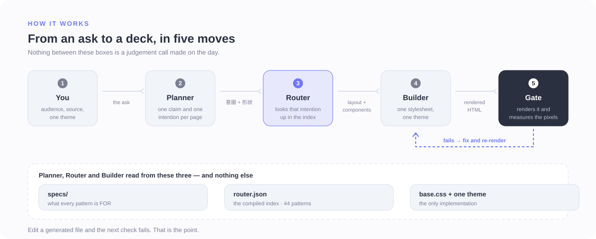
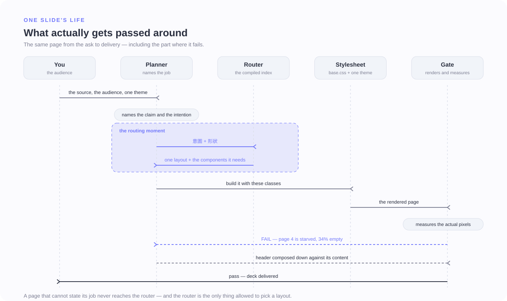
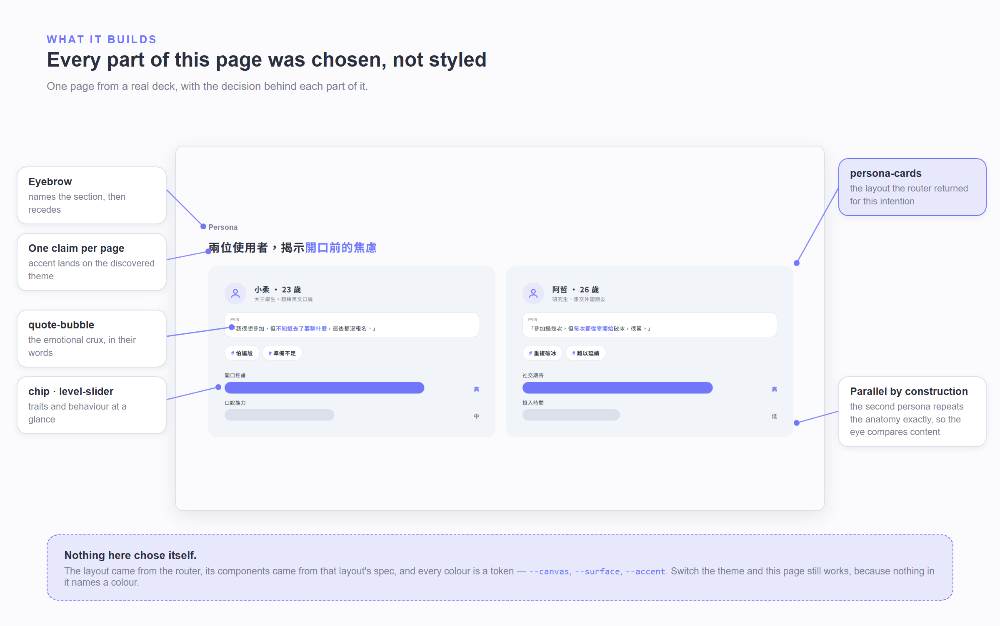
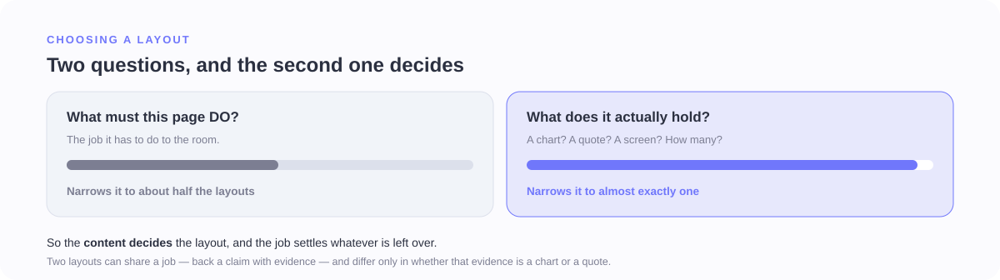
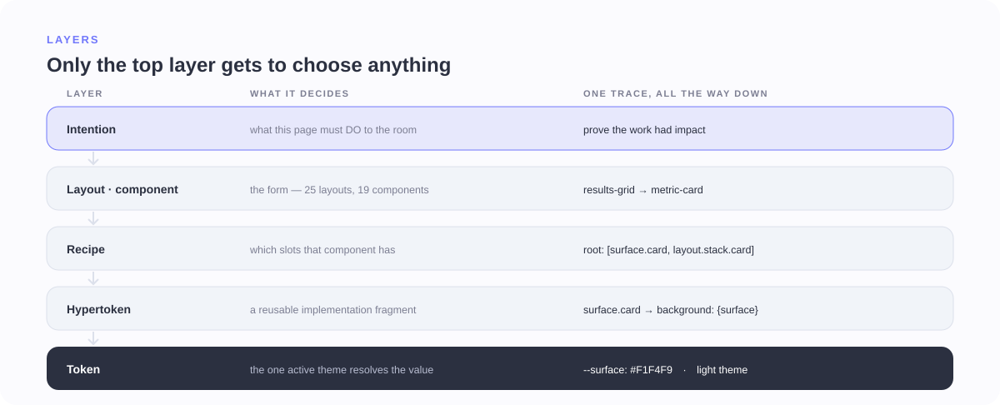
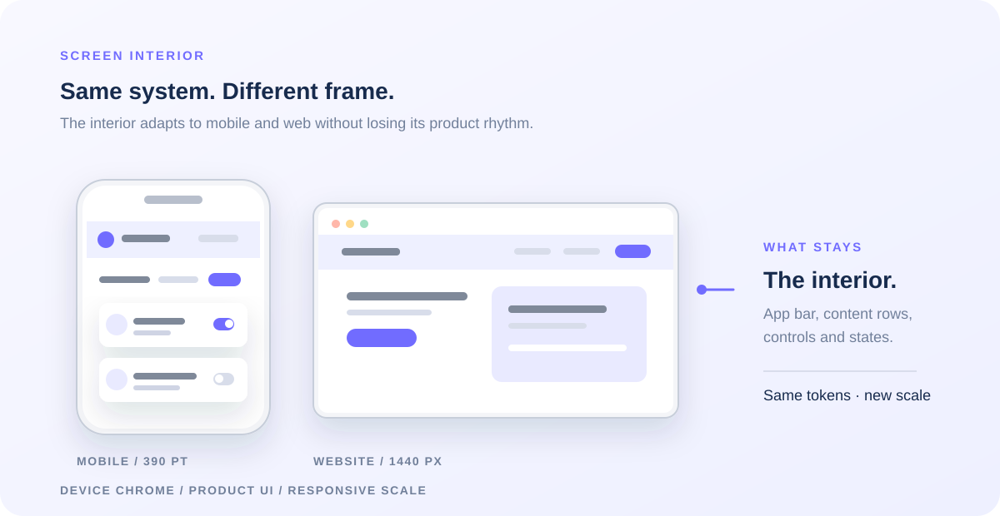
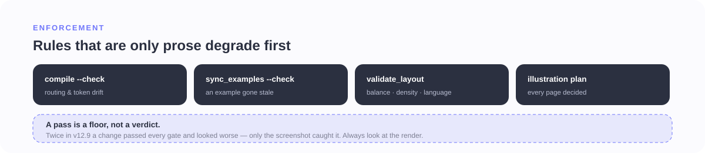
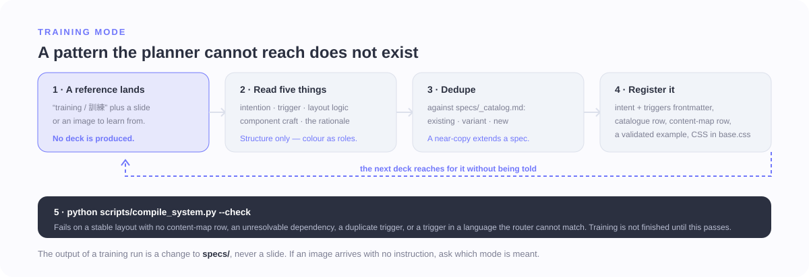

# Bonny Slide System

An intention-first agent skill for building bilingual **繁體中文 + English** UX and product decks —
as per-slide HTML, one scrolling HTML file, PDF, or PPTX.

> **The detail is not here.** [`SKILL.md`](SKILL.md) is the operating manual, `specs/` holds the rules,
> [`CHANGELOG.md`](CHANGELOG.md) holds the history. This file is the map.

---

## Why it exists

Ask two people to lay out the same research finding and you get two slides. Ask the same person twice,
a month apart, and you still get two slides. The layout gets chosen by whatever felt right that day,
so a deck drifts away from itself page by page.

This system takes that decision away from the moment. Each page has to state **what it must do** before
anything is drawn, and that statement is looked up in a compiled index. Content shape and intent narrow the candidate layouts; asset availability and the deck context resolve the choice.
The planner still requires an agent, and ambiguous requests can remain unresolved.

---

## How it works



*You bring the content; the planner names the job; the router — not the agent's taste — returns the
layout. The gate can send it back. All three middle stages read from one compiled source, so none of
them can quietly invent something.*

---

## One slide's life



*The routing moment is the whole design: a page arrives as an intention plus a shape, and leaves as a
named layout. Everything before it is planning, everything after is construction. The failure at the
bottom is the normal case, not the exception — the gate measures rendered pixels, so a starved page
comes back before anyone sees it.*

---

## What it builds



*One page of a ten-page case study. The layout, its components and every colour trace back to a
decision recorded somewhere in `specs/` — which is why the other nine pages look like they belong to
it. The full deck is in [`examples/case-study/`](examples/case-study).*

---

## How a layout gets chosen



*Both questions are asked, but the content question does most of the work. Two layouts can share a job
and differ only in whether the evidence is a chart or a quote — so the job alone cannot separate them.*

When more than one candidate survives both questions,
[`layout-choice.md`](specs/foundations/layout-choice.md) decides in a fixed order:
**availability → fit → variety → intent proximity.** A layout needing a screenshot nobody supplied is
dropped rather than faked; a repeated layout that fills the page beats a fresh one that starves it.

Triggers are multilingual — 繁中, English, Korean — because an intention does not change with the
language it is written in. What language the deck comes out in is a separate decision, enforced when
it renders.

---

## Why every deck looks like the same system



*Selection happens once, at the top. Below it, nothing has an opinion — a component cannot decide it
wants a different colour, because the only colour it knows is the name of a token.*

---

## When a page needs a picture


*Tables, data and real UI stay native and inspectable. Dialogue, workshops and workflows become a
freshly generated illustration — never reused artwork, never a diagram traced in CSS.*

| Variant | For |
|---|---|
| `agenda-dialogue` | Workshop timing, rules, grouping, voting |
| `guided-dialogue` | Human/assistant worked examples, approval loops |
| `workflow-transform` | People, roles or tools converging into one outcome |
| `ui-qa` | A real supplied interface explained in conversation |

If generation is required but unavailable, the build stops. It does not quietly fall back to text.

The same rule applies to product UI shown inside a device or app frame: the frame is only the chrome;
the **screen interior** has to read as a real screen. [`examples/light-screen-interiors.html`](examples/light-screen-interiors.html)
is the reference page for this vocabulary — app bars, list rows, toggles, sheets and popups are built
from the system tokens and scaled with the mock device, rather than pasted in as arbitrary screenshots.

`base.css` C17 ships six interiors — **overview · form-summary · rail-rows · table · empty ·
specimen** — routed through `ui-mockup`. Each is a shape rather than a screenshot: one dominant
number over a bar row, a form column against a fixed summary, a side rail with one item lit. The
arrangement is what makes the screen recognisable, so no invented data is needed to get it.



*Not a drawing of the idea — this figure is `examples/light-screen-interiors.html` itself, serialised
straight from the rendered slide, so every position and colour in it came out of the real layout. The
frame tells you what contains the UI; the interior tells you what product screen the audience is
looking at, and it re-skins with the deck theme because it is made of the same tokens.*

---

## What it refuses to ship



*The machine catches what it can measure. It cannot tell you a slide is good — three times a change
passed every check and still looked worse.*

| Checks | Catch |
|---|---|
| `validate_layout.py` | an unstyled render, dead bands, a stretched container, the wrong language, a long deck with no visual moment |
| `validate_editorial_explainer_plan.py` · `validate_generated_illustration.py` | a page that skipped its illustration, missing provenance, the wrong ratio |
| `compile_system.py --check` · `sync_examples.py --check` | token or routing drift, a pattern with no route, an example carrying stale CSS |
| `validate_routing.py` · `verify_rebuild.py` · `visual_baseline.py` | a request that stopped reaching the right layout, a pattern that cannot be rebuilt, a visual change nobody intended |
| `check_antipatterns.py` | a known-bad slide that started passing, or a gate that could not run |

The **40 existing routing cases** are now regression tests and all resolve as expected. The former
held-out set scored 8/10 before its failures were repaired; after that repair it is no longer
independent. These results do not establish accuracy on unseen user requests.

---

## How it gets better



*Send reference slides with **"training / 訓練"** and the system grows instead of producing a deck. It
reads a reference for structure, never colour, so a learned pattern works under any theme. Taste is
learned the same way — two defensible variants, judged by a person, distilled into a principle.*

---

## The repository

```text
bonnyt/
|-- SKILL.md      # the operating manual the agent reads
|-- specs/        # THE DECISION LAYER — one file per rule, component, layout
|   |-- foundations/     # 14 rules: story, typography, colour, balance, imagery...
|   |-- components/      # 19 reusable parts
|   |-- layouts/         # 25 whole-slide structures
|   |-- content-map.md   # intention -> layout + components
|   |-- generated-*.md   # compiled — never hand-edited
|   `-- preferences.md   # 55 judged A/B rounds
|-- system/       # THE MACHINE LAYER — tokens, hypertokens, recipes, compiled router
|-- assets/       # THE BUILD LAYER — base.css + generated theme files
|-- scripts/      # compiler, validation, A/B review, PDF export
|-- examples/     # current examples + frozen _ab/_audit history
`-- pptx/         # python-pptx bridge from the same tokens
```

`specs/` decides. `system/` is the machine-readable truth. `assets/` builds. Generated files are
overwritten by the compiler, and `--check` fails first if anything drifted.

---

## Getting started

The repository root *is* the skill; `SKILL.md` carries the frontmatter.

```bash
git clone https://github.com/bonny8000/bonny-slide-generate-system.git ~/.claude/skills/bonny-slide-system
```

Needs **Python 3.10+** (standard library only) and a **Chromium browser** for the render checks.
PDF export additionally needs `python -m pip install -r requirements-export.txt`.
`pptx/` needs **python-pptx** and currently implements only three native templates (`title`, `hbars`,
`features`), not all 25 HTML layouts or an HTML-to-PPTX converter. Generated illustrations need an
image-generation tool; their validator checks declared provenance, not proof of a tool invocation.

Then just ask for a deck — it will come back for the audience, the theme and any real assets before it
starts, because those decide which layouts are even eligible.

```bash
python scripts/validate_layout.py DECK.html
```

```bash
python scripts/check_system.py          # compiler, sync and regression suite
python scripts/check_system.py --render # plus current 16:9 slides, pacing and antipatterns
python scripts/export_pdf.py examples/case-study --out work/case-study.pdf
```

For linked HTML use `assets/base.css`. For self-contained HTML inline
`assets/generated/base-bundle.css` plus **exactly one** `assets/tokens-*.css` theme.

---

## At a glance

| | | | |
|---|---:|---|---:|
| Foundation rules | 14 | Routable patterns | 44 |
| Components | 19 | Indexed triggers | 327 |
| Layouts | 25 | Themes | 2 |
| Current examples · frozen history | 58 · 115 | Judged rounds · usable pairs | 55 · 42 |
| Hypertokens · recipes | 1 · 1 | Illustration variants | 4 |

**Intention** — what a page must DO; distinguishes layouts after shape matching. **Shape** — material,
arrangement and count; what the page actually holds. **Router** — the compiled index; a pattern not in
it does not exist. **Token** — a colour's name, resolved by the one active theme.

---

## Recent changes

[`CHANGELOG.md`](CHANGELOG.md) is the full history; this is only the current head.

**Consistency pass.** Three changes, each verified to leave every rendered slide pixel-identical:

- **Shared CSS de-duplicated.** Every `/* promoted from examples/… */` block had pasted its own copy
  of the common card rules — `.card` was defined nine times, `.foot` four, `.kicker` three, all
  byte-identical. One visual fact now has one definition.
- **The hypertoken layer shrank to what actually works.** Four of its five fragments restated rules
  `base.css` already had. They could never take effect: generated fragments are `:where(...)` inside
  `@layer hypertokens`, and unlayered `base.css` beats every layered rule regardless of specificity.
  Only `image.floating` adds something real, so only it remains.
- **Selection wording corrected.** Two specs still called intention the primary key while the router
  keys on shape.

Making that layer authoritative was attempted and rejected — both routes regressed against a render
baseline, one of them silently reverting a judged A/B preference. `specs/maintenance.md` records the
measurements so it is not retried blind.

**Earlier: the reliability pass.** Structural slide coverage, implicit HTML head closing, DOM-based
visual detection, separated renderer exit codes and footer false alarms. Current examples embed one
canonical bundle; dark examples declare their theme; historical A/B snapshots stay frozen.

---

**v12.18 + unreleased reliability fixes · August 2026** — routing keys on intention *and* content shape; triggers are multilingual
because intention is language-independent; layout choice, asset policy and illustration triggering are
declared data rather than judgement. Screen interiors now have a token-scaled reference; antipattern
checks distinguish rejected, leaked and unrunnable results.
