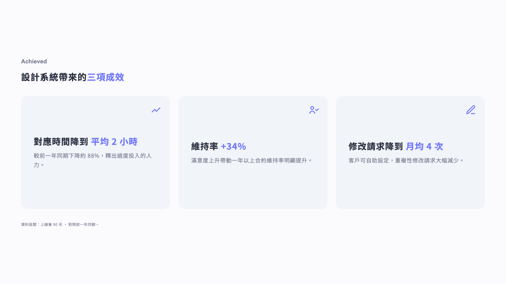
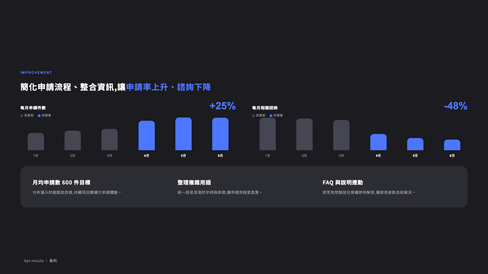
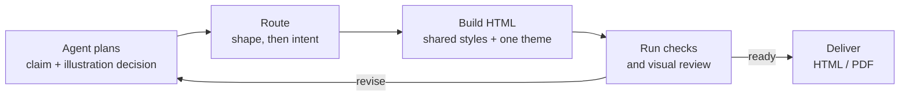
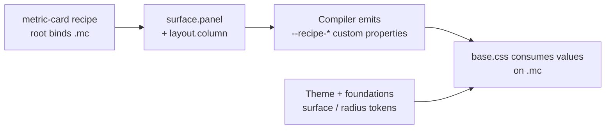
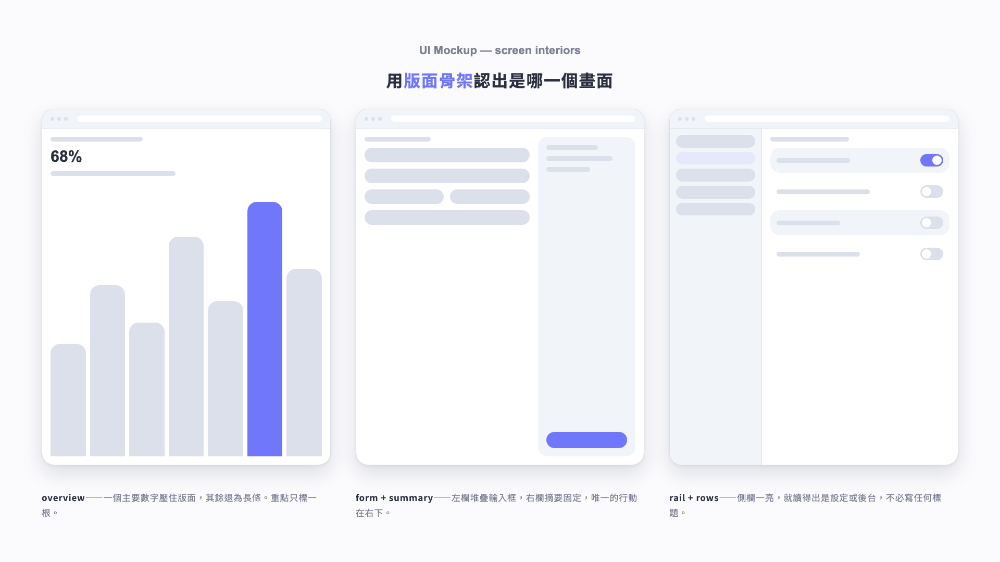

# Bonny Slide System

**A design system and agent skill for consistent UX and product presentations.**

Turn research, product decisions, and outcomes into slides with **Traditional Chinese as the primary language
and English as supporting copy**. The agent plans the story, matches the content to a catalogued
layout, builds with shared styles, and reviews the rendered result.

This repository supplies the instructions, design library, compiler, and validation tools. **It
requires an agent to plan and build a deck**; it is not a hosted editor or a standalone prompt-to-deck CLI.

[Quick start](#quick-start) · [Examples](#examples) · [Routing](#how-layout-selection-works) ·
[Hypertokens & recipes](#hypertokens-and-recipes) · [Checks & limits](#validation-and-its-limits) ·
[Agent manual](SKILL.md) · [Changelog](CHANGELOG.md)



*Actual browser render of [light-metric-cards.html](examples/light-metric-cards.html).
Example numbers are demonstration content, not claims about this project.*

## What is implemented

| Area | Current scope |
|---|---|
| Design library | **25 layouts + 19 components**, supported by 14 foundation specs |
| Routing | **44 indexed patterns**, 327 triggers in Traditional Chinese, English, and Korean; shape matching with intent disambiguation |
| Themes | Light and dark, shared token roles, one theme per deck |
| Hypertokens & recipes | **25 hypertokens, 44 connected recipes, 165 slots** — the whole current pattern catalog |
| Examples | **58 current HTML files**: 54 individual 16:9 slides, 2 posters, 1 reference gallery, 1 scroll viewer |
| Output | Individual HTML slides, a scrolling HTML deck example, and a working PDF exporter |
| Regression coverage | **49 unit tests + 40 routing cases**; browser checks run separately |
| Design learning | 55 judged A/B rounds, with 42 usable saved pairs; 115 historical HTML snapshots remain frozen |

Snapshot: **2026-08-31**. Counts describe the checked-in catalog, not an accuracy or quality score. Source indexes:
[router](system/router.json), [recipe coverage](system/resolved-recipes.json), and
[verified boundaries](specs/maintenance.md).

The existing PowerPoint bridge has only `title`, `hbars`, and `features` templates. It does **not**
convert arbitrary HTML or cover all 25 layouts. HTML and PDF are the main delivery paths described here.

## Quick start

### 1. Get the skill

The repository root contains [`SKILL.md`](SKILL.md). Install the **whole repository**, not that file alone:
the agent also needs `specs/`, `system/`, `assets/`, and `scripts/`.

For a local checkout:

```bash
git clone https://github.com/bonny8000/bonny-slide-generate-system.git
cd bonny-slide-generate-system
python3 scripts/check_system.py
```

For skill discovery, place the repository in your agent's skill directory. Common locations are
`~/.codex/skills/bonny-slide-system` for Codex and `~/.claude/skills/bonny-slide-system` for Claude Code.
If you already installed it under another name, such as `bonnyt`, update that checkout instead of
creating a second copy. In other agents, explicitly ask the agent to read the root `SKILL.md`.

### 2. Provide the brief

Specify the audience, the source material, and one theme. Supply real screenshots, logos, photos,
or data when the story depends on them. The agent asks for missing required inputs.

```text
請使用 bonny-slide-system，將附件研究整理成給產品團隊的 8 頁簡報。
使用 light 主題，繁中為主、英文輔助。
先列出每頁主張、內容形狀與插圖決策，再製作 HTML；檢查並目視確認後匯出 PDF。
```

This is an instruction to the agent, not a command accepted by a generation script.
The full workflow and conditional reading rules are in [`SKILL.md`](SKILL.md).

### 3. Check and export

| Requirement | Needed for |
|---|---|
| Python 3.10+ | Compiler and core checks; standard library only |
| Chrome, Chromium, or Edge | Rendering, geometry checks, screenshots, and PDF printing |
| `pypdf` | Merging the printed pages into a PDF; install from `requirements-export.txt` |
| Built-in image-generation tool | Slides that require a fresh generated editorial explainer |

Run commands from the repository root. Use your Python environment's executable if it differs from
`python3`; optional packages are best installed in a virtual environment.

```bash
# Check the repository, then add browser-based checks.
python3 scripts/check_system.py
python3 scripts/check_system.py --render

# Inspect an existing recipe after choosing a pattern.
python3 scripts/resolve_recipe.py metric-card --theme dark

# Export the ten individual case-study slides, in filename order.
python3 -m pip install -r requirements-export.txt
python3 scripts/export_pdf.py examples/case-study --out work/case-study.pdf
```

PDF export keeps text as text where browser/font support allows, verifies one page per input, and
leaves the source HTML unchanged. Existing output files require `--force`. Export the **individual
slide files**, not a scroll viewer, gallery, or poster. Review the PDF for font and layout changes.

## Examples

These are current HTML examples rendered in Chromium, not illustrations of a proposed feature.
Open the HTML files locally to see the full-size slides; GitHub displays their source code.

| Research: two personas | Outcomes: dark-theme KPIs |
|---|---|
|  |  |
| [HTML source](examples/case-study/04.html) | [HTML source](examples/dark-07-kpi-results.html) |

| Explore | What it demonstrates |
|---|---|
| [Ten-page case study](examples/case-study) | A sequence from problem and research through product decisions and results |
| [Eight-slide deck](examples/deck-demo) · [scroll viewer](examples/deck-demo-scroll.html) | Pacing, section transitions, and several layouts in one deck |
| [Pattern catalog](specs/_catalog.md) | Every component/layout and its reference example |
| [Editorial explainer gallery](examples/editorial-explainer-stage.html) | Illustration compositions; reference artwork is not fresh artwork for a new deck |

The examples demonstrate design patterns; sample personas, UI, and figures are not verified product
evidence. Screenshot sources and refresh instructions live in [assets/readme](assets/readme/README.md).

## How layout selection works

**Content shape is the primary key; intent helps distinguish compatible candidates.** The agent
first states the claim and derives a shape from the content it actually has:

```text
意圖: <what the slide must do for the audience>
形狀: <material> / <arrangement> / <itemCount>
```

The controlled vocabulary and explicit variants are in the
[compiled router](specs/generated-router.md). Materials include charts, quotes, statistics,
real UI screens, schematic UI mockups, illustrations, icons, logos, and text-only content.



The router supplies an index and matching rules. **It does not independently understand a brief
or guarantee one answer.** The agent writes the normalized shape; unmatched shapes and tied lexical
scores remain unresolved until the agent examines the content or asks for clarification.

For multiple compatible candidates, use
[`layout-choice.md`](specs/foundations/layout-choice.md) in this order:
**availability → fit → variety → intent proximity**. Fit outranks variety: a repeated layout can be
the right choice when it accommodates the content better.

Asset policies are part of selection, including those on a shape variant:

| Policy | Required behavior |
|---|---|
| `must-supply` | Use a real supplied asset; if missing, ask or use a declared alternate. Never invent evidence. |
| `build` | Construct a clearly schematic UI mockup from shared primitives; no real screenshot is required. |
| `generate` | Generate fresh artwork for the selected route; do not silently discard the artwork to use a text layout. |

Multilingual triggers help recognize requests; they do not determine the output language. Decks
default to Traditional Chinese + English, and can use another declared language when requested.

## Hypertokens and recipes

**The migration is complete for all 44 catalog patterns. It is no longer a three-recipe pilot.**
Coverage is at the level of reusable CSS fragments, not a JSON rewrite of every layout rule.

| Layer | Responsibility | Source |
|---|---|---|
| Tokens | Named theme and foundation values | [`system/tokens.json`](system/tokens.json) |
| Hypertokens | Reusable groups of CSS properties, such as panel surfaces or column layout | [`system/hypertokens.json`](system/hypertokens.json) |
| Recipes | Compose fragments into slots and bind them to real selectors | [`system/recipes.json`](system/recipes.json) |
| Authored CSS | Consume generated values; retain geometry, declaration order, and scoped overrides | [`assets/base.css`](assets/base.css) |

For example, `metric-card` binds its root to `.mc`, using **`surface.panel` + `layout.column`**:



```css
.mc {
  background: var(--recipe-surface-panel-background);
  border-radius: var(--recipe-surface-panel-border-radius);
  display: var(--recipe-layout-column-display);
  flex-direction: var(--recipe-layout-column-flex-direction);
  /* Padding, height, and composition-specific overrides remain authored CSS. */
}
```

The generated recipe layer supplies **custom properties**, while the structural declarations stay
at their original positions in `base.css`. This preserves the existing cascade and scoped A/B choices.
Recipes do not select layouts, and migration status never filters the catalog.

The compiler checks recipe coverage, slot bindings, selector presence in the referenced example,
and matching CSS consumers. It also rejects a selector that reads a known recipe variable **without
a binding for that selector/property**. A known variable name alone is not enough.

Use [`resolve_recipe.py`](scripts/resolve_recipe.py) to inspect managed values and theme resolution;
it does not report every computed style. See the [recipe contract](specs/tokens/recipes.md) for the
full ownership rules and supported selector grammar.

## Illustrations, evidence, and schematic UI

Every deck records **one illustration decision per slide** in `illustration-plan.json`, including
pages that do not need artwork. Covers, section covers, bridges, agenda pages, and closing pages
are structural pages with `gate: no`.

Human/agent workflows, conversational examples, workshop facilitation, and scattered-input
transformations are hard candidates for a **fresh generated editorial explainer**. Exact data,
tables, or UI evidence can justify an explicitly recorded precision override. Mixed pages can be
split into an illustrated overview and a separate evidence slide.

| Explainer variant | Typical use |
|---|---|
| `agenda-dialogue` | Workshop timing, rules, grouping, voting |
| `guided-dialogue` | Human/assistant worked examples and approval loops |
| `workflow-transform` | People, roles, or tools converging into an outcome |
| `ui-qa` | A real supplied interface explained in conversation; preserve the supplied screen |

Required artwork must come from a fresh built-in image-generation call, at the target block's
aspect ratio. Style references are references, not deliverable assets. If generation is unavailable,
the agent reports the blocker instead of substituting reused artwork or a hand-built diagram.
The validator checks **declared provenance and placement**, not proof that a tool invocation occurred.

**Schematic product UI is a separate route.** The `ui-mockup` component has `assetPolicy: build`:
the agent constructs a recognizable screen structure without presenting it as a real product screenshot.
Its six interiors are overview, form-summary, rail-rows, table, empty, and specimen.



*Three interiors from [light-screen-interiors.html](examples/light-screen-interiors.html), rendered
with the actual browser styles. This is schematic UI, not generated artwork or a supplied app screenshot.*

Read the [illustration rules](specs/foundations/generated-editorial-explainer.md),
[asset rules](specs/foundations/imagery.md), and [UI mockup spec](specs/components/ui-mockup.md)
when those routes apply.

## Validation and its limits

Checks detect drift and measurable problems. **Passing them does not certify a good-looking deck**;
render at full size, inspect the pages, and fix the weakest results before delivery.

| Check | What it covers |
|---|---|
| `check_system.py` | Generated-file freshness, current-example sync, the case-study illustration plan, unit tests, and both routing fixtures |
| `check_system.py --render` | Adds current individual-slide rendering, the two example decks' pacing checks, and known antipattern cases |
| `validate_layout.py` | Measured layout, density, language, and visual-moment heuristics; not comprehensive overflow or aesthetic detection |
| `validate_editorial_explainer_plan.py` | Per-slide decision coverage, required assets/provenance fields, and corresponding HTML placement |
| `validate_generated_illustration.py` | Image decoding, aspect ratio, and a chromatic-pixel threshold for generated artwork |
| `visual_baseline.py diff` | Compares coarse rendered fingerprints; not a guarantee of pixel equality |
| `verify_rebuild.py` | Compares selected examples with slide-specific overrides removed; not a universal layout reconstruction test |

For a new deck, repository checks alone are insufficient. Validate its own plan and individual slides:

```bash
# Replace my-deck with your deck directory.
python3 scripts/validate_editorial_explainer_plan.py my-deck/illustration-plan.json my-deck/slides
python3 scripts/validate_layout.py my-deck/slides
python3 scripts/validate_layout.py my-deck/slides --deck
```

Keep these boundaries visible:

- **Routing:** all 40 cases are regression fixtures, including the former held-out set. A fresh
  independent evaluation set has not been built, so there is no verified accuracy score for unseen briefs.
- **CI:** the current workflow runs core checks on Python 3.10 and 3.12. Browser/font-dependent checks
  and visual review are separate; a green CI run does not imply they ran.
- **Artifacts:** scroll viewers and reference galleries are not individual slides. Posters require
  an explicit full height and separate inspection; their first viewport is not a complete review.
- **Recipes:** all patterns are connected, but geometry, pseudo-elements, contextual overrides,
  and data-driven dimensions remain CSS responsibilities.
- **PPTX:** the three-template bridge is limited; full editable PowerPoint coverage is not implemented.

See [maintenance and verified boundaries](specs/maintenance.md) and the
[delivery audit](specs/audit.md) for the detailed workflow.

## Training mode

“Training” grows the design library; it is not model fine-tuning and does not produce a deck.
Send reference slides with an explicit request such as:

```text
訓練：請從這張參考圖學習意圖、觸發條件、版面結構與元件安排，更新既有規格。
先比對 catalog，避免新增重複版型；不要製作簡報。
```

The agent reads the reference's intention, triggers, layout logic, component craft, and rationale.
It records colors as token roles, compares against the existing catalog, then extends an existing
pattern or adds a new one. A new pattern needs routing metadata, catalog/content-map entries,
shared CSS, a connected recipe, and a validated example. An image with no clear instruction requires
clarification between learning and building.

Human A/B choices are recorded in [preferences](specs/preferences.md); the
[compiled digest](specs/generated-preferences-digest.md) is the smaller build-time reference.
Saved judgments are design evidence, not an automatic taste score.

## Maintaining the system

```text
SKILL.md                Agent operating procedure
specs/                  Foundations, themes, layouts, components, routing metadata, preferences
system/                 Canonical tokens, hypertokens, recipes, schemas, compiled indexes
assets/base.css         Authored shared CSS
assets/generated/       Compiled foundations, fragments, bindings, and self-contained bundle
assets/readme/           Browser-rendered README screenshots and their source manifest
scripts/                Compile, sync, validate, compare, and export
tests/                  Core regression tests
examples/               Current examples and frozen _ab/_audit history
pptx/                   Shared token bridge and three native PowerPoint templates
```

Edit the canonical sources, then regenerate and verify:

```bash
python3 scripts/compile_system.py
python3 scripts/sync_examples.py
python3 scripts/check_system.py

# For changes that affect appearance:
python3 scripts/check_system.py --render
python3 scripts/visual_baseline.py diff
python3 scripts/render_readme.py
```

- **Linked HTML:** load `assets/base.css` and exactly one `assets/tokens-light.css` or
  `assets/tokens-dark.css` theme.
- **Self-contained HTML:** inline one theme and `assets/generated/base-bundle.css`.
  The bundle already contains `base.css`; do not include it twice.
- **Slide-specific adjustments:** use `<style data-slide>`; sync preserves this block.
  Reusable component changes belong in scoped shared CSS.
- **Generated outputs:** do not edit generated CSS, router tables, or the Python token bridge by hand.
- **Historical evidence:** normal sync excludes the frozen `_ab`/`_audit` examples. Do not bulk-update
  old comparisons to make them look current.

The README's flow diagrams are editable Mermaid source; screenshots are regenerated from current
HTML. When changing the catalog or implementation, update the relevant text and visuals together.
For architectural decisions and earlier experiments, read [maintenance](specs/maintenance.md)
and [CHANGELOG.md](CHANGELOG.md).
