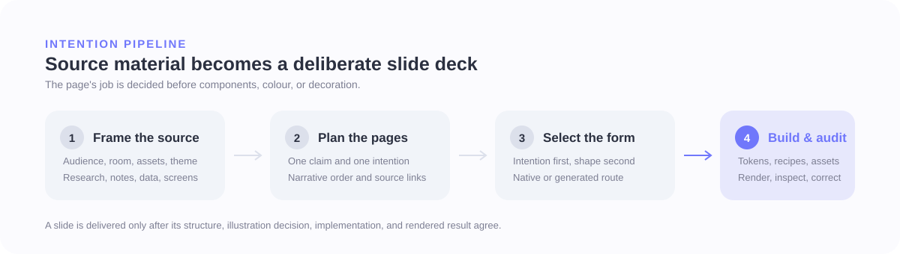
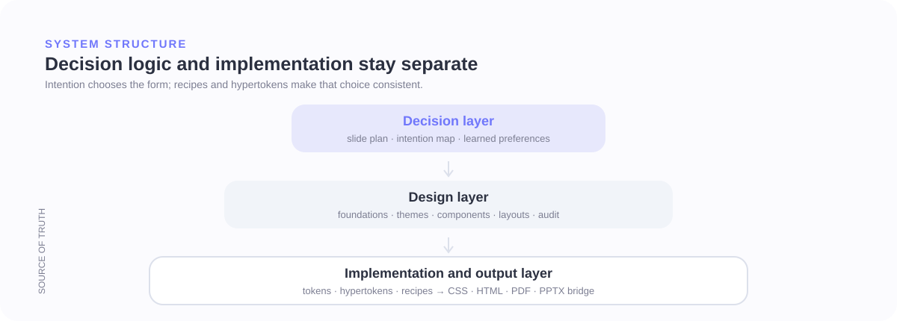
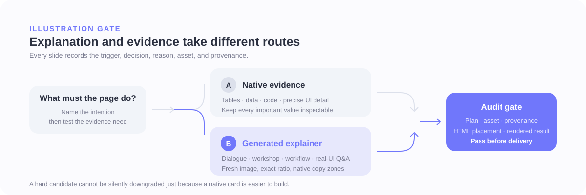

# Bonny Slide System

An intention-first agent skill for building bilingual **Traditional Chinese + English** UX and product decks.

Think of `specs/` as the decision engine, `system/` as the machine-readable design logic, and `assets/`
as the build layer. The agent plans the argument, maps each slide to the right visual form, builds it from
the system, and audits the rendered result before delivery.



## What This Repository Contains

- `SKILL.md` is the agent operating manual and release history.
- `specs/` contains the foundations, themes, components, layouts, intention map, audit, and learned preferences.
- `system/` contains canonical tokens, hypertokens, recipes, and strict JSON schemas.
- `assets/` contains the component CSS, generated bundles, theme outputs, and illustration references.
- `scripts/` contains the deterministic compiler, prompt builder, and validation tools.
- `examples/` contains render-validated slides and short deck sequences.
- `pptx/` contains the python-pptx bridge built from the same token source.

The core rule is simple: **decide what the slide must do before deciding what it should look like**.

## Current Shape

| Area | Current count | Notes |
|---|---:|---|
| Foundation rules | 13 | Story, typography, imagery, colour, balance, audit, learning, and source sync |
| Stable components | 19 | Reusable evidence, metric, comparison, UI, quote, and support patterns |
| Stable layouts | 25 | Whole-slide structures selected by communicative intention |
| HTML examples | 164 | Individual examples, audit builds, and short deck sequences |
| Preference rounds | 50 | Render-tested A/B choices distilled into transferable principles |
| Hypertokens | 5 | Reusable surface, type, layout, and image implementation fragments |
| Pilot recipes | 3 | Slot mappings for metric cards, evidence cards, and feature showcases |
| Editorial variants | 4 | Workshop, guided dialogue, workflow transformation, and real-UI Q&A |

## System Structure



The layers have different responsibilities:

- **Decision layer:** `slide-plan.md` names one claim and one intention per page; `content-map.md` selects
  the layout and components.
- **Design layer:** foundations, themes, components, layouts, and the preference library define what
  good work means.
- **Implementation layer:** recipes connect component slots to hypertokens; hypertokens resolve semantic
  token values into reusable CSS fragments.
- **Output layer:** the compiler produces CSS, a PPTX token bridge, and an LLM-readable reference.

Hypertoken migration status has no selection weight. The full component and layout catalogue remains
available, and intention continues to choose the form.

## How the Workflow Works

1. Confirm the audience, room, source, theme, and required real assets.
2. Turn the source into a complete page plan with one claim and one intention per slide.
3. Order the reasoning before the conclusion and place covers, section breaks, and bridges.
4. Record every slide in `illustration-plan.json`, including the trigger, gate, reason, and any precision override.
5. Use `content-map.md` to select the visual route, layout, and components.
6. Build with `assets/base.css`, one theme, semantic tokens, recipes, and hypertokens.
7. Generate a fresh editorial explainer when the gate requires one.
8. Render the deck, inspect balance and density, correct the weakest page, and repeat until the audit passes.

The same source can produce a different slide when the audience job changes:

| Intention | Typical signal | Selected form |
|---|---|---|
| Teach how to use a product | A real screen with spatial steps | Annotated screenshot |
| Explain a people-and-tool hand-off | Roles and tools converge into one outcome | Generated workflow transformation |
| Prove impact | A precise metric, table, chart, or evidence | Native, inspectable data layout |
| Help the room choose | Options compared against shared criteria | Comparison table |
| Re-orient the audience | A new chapter or major change of topic | Section cover |

## Illustration Routing



Every page receives an explicit illustration decision. Human/assistant dialogue, workshop facilitation,
multi-tool hand-offs, and scattered inputs becoming shared intent are hard candidates for a newly generated
editorial explainer. Tables, code, dense comparisons, data, and detailed UI evidence stay native and inspectable.

Generated explainers are not CSS diagrams or reused reference artwork. The system requires:

- a fresh built-in image-generation call;
- one sanctioned composition variant;
- the exact target aspect ratio;
- a local asset with generator provenance;
- native, editable copy zones; and
- plan and HTML validation before delivery.

| Variant | Best used for |
|---|---|
| `agenda-dialogue` | Workshop timing, rules, prompts, grouping, voting, and discussion |
| `guided-dialogue` | Human/assistant worked examples, approval loops, and agent-assisted operations |
| `workflow-transform` | Scattered viewpoints, people, roles, or tools converging into one shared outcome |
| `ui-qa` | A real supplied interface explained through participant/assistant conversation |

If generation is required but unavailable, the build stops instead of quietly falling back to native cards.

## Hypertokens

Tokens carry semantic values. Hypertokens turn those values into reusable implementation fragments such as
`surface.card`, `text.heading`, and `image.floating`. Recipes attach the fragments to component slots:

```json
"metric-card": {
  "slots": {
    "root": ["surface.card", "layout.stack.card"],
    "supporting": ["text.supporting"]
  }
}
```

The separation is deliberate:

- intention selects the layout or component;
- recipes describe its slots;
- hypertokens provide reusable visual behaviour;
- tokens resolve the active theme; and
- the compiler generates consistent implementation outputs.

## Quality Gate

A deck is complete only when the rendered pages pass the system:

- one theme and one chromatic accent;
- Traditional Chinese primary, with supporting English;
- one claim per slide;
- a complete illustration plan with valid provenance;
- no silent downgrade of hard candidates;
- balanced whole-page composition and readable density;
- at least one or two genuine visual moments in decks of eight or more pages; and
- re-rendered evidence that the weakest page has been corrected.

## Directory Map

```text
bonnyt/
|-- SKILL.md              # agent operating manual
|-- README.md             # GitHub-facing system overview
|-- specs/                # rules, themes, components, layouts, intention map, audit and preferences
|-- system/               # canonical tokens, hypertokens, recipes and JSON schemas
|-- scripts/              # compiler, prompt builder and validators
|-- assets/               # component CSS, generated bundles, themes and illustration references
|-- examples/             # render-validated slides and complete short-deck examples
`-- pptx/                 # python-pptx bridge using the same token system
```

`specs/` is the source of truth for design rules and selection logic. `system/*.json` is the source of
truth for machine-readable tokens, hypertokens, and recipes. Generated files must not be edited by hand.

## Compile and Validate

```powershell
python scripts/compile_system.py
python scripts/compile_system.py --check
```

For a deck that uses editorial explainers:

```powershell
python scripts/validate_editorial_explainer_plan.py illustration-plan.json DECK.html
```

Use `assets/base.css` for linked HTML. For self-contained HTML, inline
`assets/generated/base-bundle.css` plus exactly one `assets/tokens-*.css` theme.

---

**v12.8 · July 2026** — intention-first selection, enforced illustration routing, hypertoken-backed
implementation, and deck-level visual pacing.
