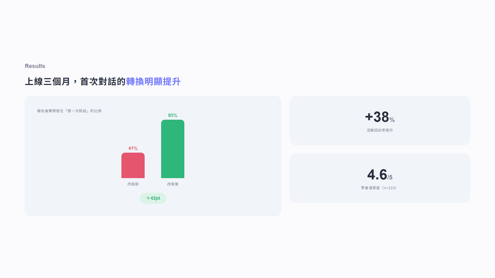
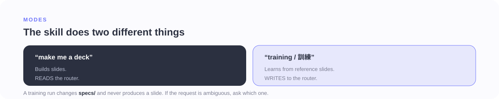
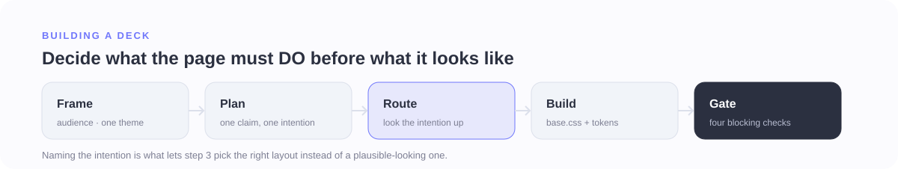
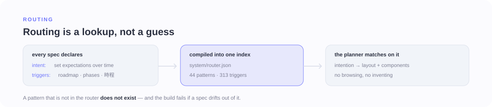
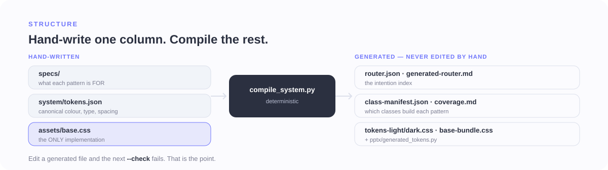
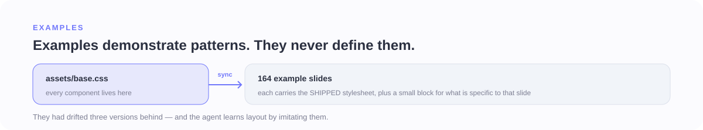

# Bonny Slide System

An intention-first agent skill for building bilingual **繁體中文 + English** UX and product decks —
delivered as per-slide HTML, a single scrolling HTML file, PDF, or PPTX.

You give it an audience and a source. It plans the deck page by page, names what each page has to
**do** to the room, looks that job up in a compiled router instead of inventing a layout, builds the
page from one shared stylesheet, and has to clear a set of blocking checks before it is allowed to
hand anything over.

| Cover | Persona research | Results |
|---|---|---|
|  |  |  |

*Three of the ten pages in [`examples/case-study/`](examples/case-study) — planned, routed, built and
gate-checked by the system, from one theme and one accent.*

---

## Contents

[What this is](#what-this-is) ·
[How a deck gets built](#how-a-deck-gets-built) ·
[One page, end to end](#one-page-end-to-end) ·
[Routing](#routing-the-part-that-does-the-deciding) ·
[The layers underneath](#the-layers-underneath) ·
[Illustration routing](#illustration-routing) ·
[What is enforced](#what-is-enforced) ·
[Training mode](#training-mode--how-the-system-learns) ·
[Getting started](#getting-started) ·
[Repository map](#repository-map) ·
[Current shape](#current-shape) ·
[Glossary](#glossary)

---

## What this is

It is a **skill an agent reads**, not an application you run and not a folder of templates.
`SKILL.md` is the operating manual; everything else is the reasoning the manual points at.

Three directories carry the whole system:

- **`specs/` is the decision engine.** One Markdown file per rule, component and layout, each
  declaring what it is FOR. This is what makes two decks built a month apart look like the same
  system.
- **`system/` is the machine-readable design logic.** Canonical tokens, hypertokens, recipes, JSON
  schemas, and the compiled router — the parts that must not drift, so they are generated and checked
  rather than remembered.
- **`assets/` is the build layer.** One hand-written stylesheet plus generated theme files. Every
  slide in this repository is built from it; none carries its own copy.

The core rule: **decide what the slide must DO before deciding what it should look like.**

### What it is not

- **Not a template gallery.** Nothing is picked because it looks good on the day. Every layout is
  indexed by the job it performs, and choosing one is a lookup.
- **Not a text-to-slides generator.** A page whose claim and intention cannot be stated in one line
  does not get built; naming the intention is what makes the next step possible at all.
- **Not a component library you install.** The deliverable is a deck. The repository is the reasoning
  that keeps decks consistent — and, increasingly, the checks that keep the reasoning honest.



Asking for a deck **reads** the router. Saying **"training / 訓練"** and sending reference slides
**writes** to it — see [Training mode](#training-mode--how-the-system-learns). If a reference image
arrives with no instruction, the agent asks which mode is meant, because the two produce completely
different artifacts.

---

## How a deck gets built



1. **Frame.** Confirm the audience and room, one theme (mode + accent) for the whole deck, the source,
   and any **real** assets the deck will need — screenshots, logos, photos, data. Real assets are
   asked for up front because a missing one changes which layouts are even eligible.
2. **Plan.** Turn the source into a page-by-page plan with one claim and one intention per slide.
   Order the reasoning before the conclusion — method → range → relationships → conclusion — and place
   covers, section covers and bridges. No components or layouts yet.
3. **Decide the illustration.** Every page gets an explicit record in the deck's
   `illustration-plan.json`: the trigger, whether it is a hard candidate, the gate decision, and the
   reason. An omitted decision is a build error, not a default.
4. **Route.** For each page, write one normalised line, then look it up. This is the step the whole
   system exists to make possible — see [Routing](#routing-the-part-that-does-the-deciding).
5. **Build.** Write HTML with `assets/base.css` classes and exactly one theme file. Token names only;
   colour is never hardcoded.
6. **Gate.** Render, measure, look, fix the weakest page, repeat until the audit passes.
7. **Deliver.** Per-slide HTML, single-scroll HTML, PDF, or PPTX.

Read-cost is part of the design. Loading every rule before building cost ~170 KB and most of it did
not apply to the slide in hand, so seven core foundations (~25 KB) are read every time and the rest sit
behind explicit triggers — `layout-choice.md` only when the router leaves two candidates,
`imagery.md` only when the user supplied real images. That is 170 KB → 71 KB per build.

---

## One page, end to end

Page 4 of the case study above, from request to render.

**1 · The plan names the job, not the look**

> Claim: 「兩位使用者，揭示開口前的焦慮」
> Intention: let the room meet the real users and see what stops them.

**2 · The planner writes one normalised line — derived from the content in hand**

```text
意圖: let the room meet the real users and what stops them
形狀: quote+illustration / grid / few
```

**3 · That line is looked up in the compiled router** (`system/router.json`)

```json
"persona-cards": {
  "intent": "anchor design in real users and surface their pain points",
  "material": "quote+illustration", "arrangement": "grid", "itemCount": "few",
  "triggers": ["persona(s)", "user archetype", "two personas",
               "behavior traits + pain points", "使用者輪廓", "人物誌", "使用者樣貌"],
  "alternates": ["use-case-cards"],
  "dependsOn": ["persona", "level-slider", "chip", "quote-bubble", "tokens"],
  "spec": "specs/layouts/persona-cards.md",
  "example": "examples/light-persona-cards.html"
}
```

**4 · The spec says why that anatomy does the job**, so the build is not a guess about arrangement:
avatar and a first-person quote make the persona human rather than a spec; the quote carries the
emotional crux; behaviour sliders quantify traits at a glance; and the pain points are the design fuel,
which is why this persona is on the slide at all.

**5 · The illustration decision is recorded.** The evidence here is participant quotes that must stay
readable, so the page stays native — `gate: no`, with the reason written down. The record format is in
[`specs/editorial-explainer-plan.example.json`](specs/editorial-explainer-plan.example.json).

**6 · Build** with `base.css` classes (`.pcard`, `.pavatar`, `.qbubble`, `.skill-chip`, `.hbar`) plus
one theme file. Nothing in the page hardcodes a colour.

**7 · Gate.** `validate_layout.py` renders the slide headlessly and measures balance, distribution and
density on the pixels — the same thing a person sees, and the only way to catch a silently unstyled
render that would otherwise pass every structural check.

**8 · Look at it.**


---

## Routing: the part that does the deciding



Each spec declares what it is FOR (`intent`), what material the slide actually holds
(`material` / `arrangement` / `item_count`), and what phrasing should summon it (`triggers`). The
compiler turns all of it into one index, so choosing a layout is a lookup rather than a judgement made
afresh each time — and a pattern that falls out of the index fails the build rather than going quietly
missing.


**Routing keys on two axes, and the second is the decisive one.** Measured on this library, the
`intent` lines alone identify **13 of 25** layouts: several pairs share a job and separate only on the
material they need. `idea-evidence` and `painpoint-evidence` both back a claim with evidence, one with
a chart and one with participant quotes; `hero-radial` and `linked-circles` both arrange concepts, one
as a centre with satellites and one as a continuum. The shape triple alone identifies **24 of 25**, so
shape decides and intent breaks the remaining tie.

Writing the normalised line *before* the lookup is what keeps the shape honest — it is derived from the
content actually in hand rather than the layout being hoped for. On held-out requests that took routing
from 4/10 to 8/10, with nothing left unresolved.

Triggers are deliberately multilingual (繁中, English, Korean). **Intention does not change with the
language it is written in**, and much of this library was learned from Korean reference decks, so
deleting that vocabulary deleted recognition rather than risk. Output language is a separate concern,
enforced at render time by `validate_layout.py --lang`.

Where the router leaves more than one candidate,
[`specs/foundations/layout-choice.md`](specs/foundations/layout-choice.md) decides in a fixed order:

| Order | Rule | Why |
|---|---|---|
| 1 | **Availability** | A layout needing a real screenshot the user has not supplied is disqualified rather than faked. A *schematic* mockup is drawn by the system, so it never disqualifies anything; a missing **illustration** is a routed decision to generate one. |
| 2 | **Fit** | Prefer the candidate whose `item_count` matches what you actually have. Three items in a "many" layout starves the slide; seven in a "pair" overflows it. |
| 3 | **Variety** | Only among candidates that already fit. A repeated layout that fills the page beats a fresh one that starves it. |
| 4 | **Intent proximity** | Last, and only to separate what is otherwise equal. |

---

## The layers underneath


Intention picks the form. Everything below that is implementation, and none of it gets a vote —
hypertoken migration status in particular carries **zero** selection weight, so the full catalogue
stays available and intention keeps choosing.

- **Tokens** carry semantic values for the active theme (`--surface`, `--accent`).
- **Hypertokens** turn those values into reusable implementation fragments — `surface.card`,
  `text.heading`, `image.floating`.
- **Recipes** attach fragments to a component's slots:

```json
"metric-card": {
  "slots": {
    "root": ["surface.card", "layout.stack.card"],
    "supporting": ["text.supporting"]
  }
}
```



Only the left column is written by hand. The router, the class manifest, both theme files, the CSS
bundle and the PPTX token bridge are all compiled from it, and `--check` fails if any of them drifts.
`base.css` is the one deliberate exception: it stays hand-written, because it is a usage contract, not
codegen.



`examples/` carries the shipped stylesheet rather than a copy of it, so an example can no longer drift
behind the specs it is supposed to demonstrate. They had been three versions behind — and the agent
learns layout partly by imitating them, which is exactly why that mattered.

The four responsibilities, stated once:

- **Decision layer:** `slide-plan.md` names one claim and one intention per page; `content-map.md`
  turns that into a layout and its components.
- **Design layer:** foundations, themes, components, layouts and the preference library define what
  good work means here.
- **Implementation layer:** recipes connect component slots to hypertokens; hypertokens resolve
  semantic tokens into reusable CSS.
- **Output layer:** the compiler produces CSS, the PPTX token bridge, and an LLM-readable reference.

---

## Illustration routing


Every page receives an explicit illustration decision. Human/assistant dialogue, workshop
facilitation, multi-tool hand-offs and scattered inputs becoming shared intent are **hard candidates**
for a newly generated editorial explainer. Tables, code, dense comparisons, data and detailed UI
evidence stay native and inspectable.

Generated explainers are not CSS diagrams and not reused reference artwork. The system requires a
fresh built-in image-generation call, one sanctioned composition variant, the exact target aspect
ratio, a local asset with generator provenance, native editable copy zones, and plan + HTML validation
before delivery.

| Variant | Best used for |
|---|---|
| `agenda-dialogue` | Workshop timing, rules, prompts, grouping, voting, and discussion |
| `guided-dialogue` | Human/assistant worked examples, approval loops, agent-assisted operations |
| `workflow-transform` | Scattered viewpoints, people, roles or tools converging into one shared outcome |
| `ui-qa` | A real supplied interface explained through participant/assistant conversation |

Two rules keep this from decaying into decoration. A hard candidate may only use `gate: no` with an
explicit precision override — "this table must stay inspectable" is a reason; "a text layout was
easier" is not. And if generation is required but unavailable, **the build stops** rather than quietly
falling back to native cards.

---

## What is enforced


Rules that exist only as prose degrade first, so the ones that can be measured are checked by a command
rather than by good intentions.

| Command | What it catches | When |
|---|---|---|
| `validate_layout.py DECK.html` | blank or unstyled render, dead bands inside the content, a stretched container, copy in a language the deck did not declare | every deck |
| `validate_layout.py slides/ --deck` | a deck of 8+ slides with no visual moment | every deck |
| `validate_editorial_explainer_plan.py` | a page that silently skipped a selected explainer; missing provenance | decks with explainers |
| `validate_generated_illustration.py` | a generated image at the wrong ratio, or effectively grayscale | decks with explainers |
| `compile_system.py --check` | token and routing drift; a pattern with no route; a duplicate or unmatchable trigger | on any system change |
| `sync_examples.py --check` | an example carrying its own stale copy of the CSS | on any system change |
| `verify_rebuild.py` | a pattern that cannot be rebuilt from `base.css` alone | on any system change |
| `visual_baseline.py diff` | a visual change nobody intended | on any system change |
| `validate_routing.py` | a real request that no longer reaches the right layout | on any routing change |
| `check_antipatterns.py` | a known-bad slide that has started passing | on any gate change |
| `check_style_rules.py` | zebra fill, accent carried by fill rather than by ink, accent spread too wide — **advisory** | on any style change |
| `calibrate_gate.py` | whether the gate still agrees with recorded human taste — **advisory** | on any gate change |

`validate_routing.py` runs two fixtures and the gap between them is the point. The working set scores
**30/30** because triggers were sharpened against it, which makes that number nearly meaningless; the
held-out set was written afterwards without consulting any trigger list and scores **8/10**. Trust the
held-out one, and if you ever tune against it, it is spent — write a new one.

### What the gates do not catch

**Whether the slide is any good.** Three times now a change has passed every gate and looked worse —
most recently a card layout that went FAIL to pass at 34% whitespace with its label, title and body
flung to the card's extremes. A pass bought that way is worth less than the failure.

Both blind spots are documented rather than papered over. The emptiness checks scan rows across the
whole canvas, so a card inflated in one column can hide behind a neighbouring column's text; and the
routing score is a lexical lower bound, since the agent matches semantically and will do better. Treat
a pass as a floor, not a verdict, and look at the render.

The system also has a measured opinion about what does *not* work. Nine geometric measures were scored
against 37 labelled A/B pairs — coverage, interior gap, band ratio, quadrant spread, ink ratio and the
rest — and **none** separated a preferred slide from a rejected one. What did carry signal was static:
accent carried on **type** rather than on a filled surface agreed with the user on 14 of 19 rounds. So
the taste checker reads the stylesheet, not the pixels, and stays advisory at that confidence.

Where content genuinely does not fill the canvas, no gate setting fixes it and neither does geometry —
growing figures, stretching rows and re-anchoring the page were all measured and all reverted. What
works is composition: bring the header down against its content so the two read as one block, and let
the leftover become even margin. That took the balance gate from 15 failures to 7.

---

## Training mode — how the system learns


Send reference slides with **"training / 訓練"** and the system grows instead of producing a deck.

1. **Read the reference for five things** — its intention (the job it does to the audience), the
   trigger (what content should summon it next time), the layout logic, the component craft, and the
   intention↔component rationale. **Structure only:** colours are recorded as token roles, never hex,
   so every learned pattern stays theme-agnostic. A reference in any language teaches structure only —
   the deck's output language is a separate, declared decision.
2. **Dedupe against `specs/_catalog.md`** → existing (add to `learned_from`) · variant (extend the
   spec) · new (create one from `spec-template.md`).
3. **Register it so it is actually reachable** — `intent` + `triggers` frontmatter, a catalogue row, a
   `content-map.md` row keyed on intention, and a render-validated example. If the pattern needs CSS,
   it goes into `assets/base.css`, not only into the example; otherwise it has to be reinvented on
   every build, which is how consistency drifts.
4. **Close the loop.** `compile_system.py --check` must pass — it fails on a stable layout with no
   `content-map.md` row, an unresolvable dependency, a duplicate trigger, or a trigger in a language
   the router cannot match on.
5. **Report what the system learned** — the pattern, its intention, its triggers, and what will now
   route to it.

The point of training is that the *next* deck reaches for it automatically. A training run changes
`specs/` and never outputs a slide.

Taste is learned the same way, through A/B rounds: two defensible variants of one slide, rendered side
by side, judged by a person, then distilled into transferable principles. Fifty rounds are recorded in
`specs/preferences.md`; a build reads the 3.6 KB compiled digest rather than the 51 KB source, and the
two cannot drift because the digest is generated. **A round is only worth running if both variants are
defensible** — a pair where one option is obviously broken teaches nothing except that broken is worse.

---

## Getting started

### Install

The repository root *is* the skill: `SKILL.md` carries the frontmatter, so put the folder wherever your
agent reads skills from.

```bash
git clone https://github.com/bonny8000/bonny-slide-generate-system.git ~/.claude/skills/bonny-slide-system
```

Use `.claude/skills/` inside a project instead if you only want it there. The folder name does not
matter; the `name: bonny-slide-system` in the `SKILL.md` frontmatter is what the agent matches on.

### Prerequisites

| For | You need |
|---|---|
| The compiler and every validator | **Python 3.9+**, standard library only |
| `validate_layout.py`, `visual_baseline.py`, `ab_round.py` | a **Chromium browser** — Chrome or Edge; pass `--browser` if it is not on a default path |
| The PPTX bridge in `pptx/` | **python-pptx** |
| Generated editorial explainers | a built-in image-generation tool available to the agent |

### Ask for a deck

Talk to the agent normally:

> 幫我用這份研究筆記做一份 UX case study，給設計評審看，light theme。

Expect it to come back for the audience, the theme, and any **real** screenshots, logos, photos or data
before it starts — those decide which layouts are even eligible.

### Verify a deck

```bash
python scripts/validate_layout.py DECK.html
```

```bash
python scripts/validate_layout.py slides/ --deck
```

```bash
python scripts/validate_editorial_explainer_plan.py illustration-plan.json DECK.html
```

### Verify the system after changing it

```bash
python scripts/compile_system.py --check
```

```bash
python scripts/sync_examples.py --check
```

```bash
python scripts/validate_routing.py --cases specs/routing-cases-heldout.md
```

`compile_system.py` without `--check` regenerates the CSS, the router, the PPTX bridge and the
Markdown references. `verify_rebuild.py`, `visual_baseline.py diff` and `check_antipatterns.py` round
out the system-level set.

### Using the CSS directly

Use `assets/base.css` for linked HTML. For self-contained HTML, inline
`assets/generated/base-bundle.css` plus **exactly one** `assets/tokens-*.css` theme.

---

## Repository map

```text
bonnyt/
|-- SKILL.md              # the agent operating manual — start here
|-- README.md             # this file
|-- CHANGELOG.md          # version history; not needed at build time
|-- specs/                # rules, themes, components, layouts, intention map, audit, preferences
|   |-- foundations/      # 14 rules: story, typography, colour, balance, imagery, self-critique...
|   |-- components/       # 19 reusable parts
|   |-- layouts/          # 25 whole-slide structures
|   |-- content-map.md    # intention -> layout + components, with detection heuristics
|   |-- generated-*.md    # compiled router, class coverage, preferences digest — never hand-edited
|   `-- preferences.md    # 50 judged A/B rounds and the principles drawn from them
|-- system/               # canonical tokens, hypertokens, recipes, JSON schemas, compiled router
|-- scripts/              # the compiler, a prompt builder, a round scaffolder, and 10 checks
|-- assets/               # base.css, generated bundles, theme files, illustration references
|-- examples/             # render-validated slides, two short decks, A/B rounds
`-- pptx/                 # python-pptx bridge built from the same token source
```

`specs/` is the source of truth for design rules and selection logic. `system/*.json` is the source of
truth for machine-readable tokens, hypertokens and recipes. **Generated files must not be edited by
hand** — the compiler will overwrite them, and `--check` will fail first.

---

## Current shape

| Area | Count | Notes |
|---|---:|---|
| Foundation rules | 14 | Story, typography, imagery, colour, balance, audit, learning, source sync |
| Stable components | 19 | Reusable evidence, metric, comparison, UI, quote and support patterns |
| Stable layouts | 25 | Whole-slide structures selected by communicative intention |
| Routable patterns | 44 | Compiled into `system/router.json` + `specs/generated-router.md` |
| Indexed triggers | 313 | 繁中, English and Korean surface forms across those 44 patterns |
| Themes | 2 | `light-periwinkle`, `dark-periwinkle` — one per deck, one accent |
| Example files | 172 | 39 single-pattern · 18 deck pages · 11 audit builds · 104 A/B variants |
| Preference rounds | 50 judged | Plus 5 declared and waiting for a verdict in `specs/ab-rounds.md` |
| Hypertokens | 5 | Reusable surface, type, layout and image fragments |
| Pilot recipes | 3 | Slot mappings for metric cards, evidence cards, feature showcases |
| Editorial variants | 4 | Workshop, guided dialogue, workflow transformation, real-UI Q&A |
| Scripts | 13 | 1 compiler · 1 prompt builder · 1 round scaffolder · 10 checks |

Two numbers are worth reading together: routing scores **30/30** on the fixture it was tuned against
and **8/10** on the held-out one. The second is the real one.

---

## Glossary

| Term | Meaning |
|---|---|
| **Intention** | What a page must DO to the room — not what it contains. The only thing that selects a form. |
| **Shape** | The `material / arrangement / item_count` triple describing what the slide actually holds. The decisive routing axis. |
| **Trigger** | A phrase, in any of three languages, that should summon a pattern. Compiled into the router. |
| **Router** | `system/router.json` — the compiled index of every pattern. A pattern not in it does not exist. |
| **Component / layout** | A reusable part, and a whole-slide structure. Layouts are the unit of selection. |
| **Recipe** | Which hypertokens fill a component's slots. |
| **Hypertoken** | A reusable implementation fragment (`surface.card`) sitting between tokens and CSS. |
| **Token** | A semantic value resolved by the one active theme (`--surface`, `--accent`). |
| **Hard candidate** | A page whose content — dialogue, workshop, workflow, scattered inputs — presumptively needs a generated explainer. |
| **Editorial explainer** | A freshly generated illustration in one of four sanctioned compositions, with provenance recorded. |
| **Gate** | A command that can fail a build. A pass is a floor, not a verdict. |

---

## Quality gate

A deck is complete only when the rendered pages pass:

- one theme and one chromatic accent;
- 繁體中文 primary, with supporting English (or another language, declared);
- one claim per slide, in plain language;
- a complete illustration plan with valid provenance, and no silent downgrade of a hard candidate;
- balanced whole-page composition and readable density, measured on the rendered pixels;
- no visual drift against the recorded render fingerprints;
- at least one or two genuine visual moments in decks of eight or more pages; and
- re-rendered evidence that the weakest page has been corrected.

---

**v12.18 · August 2026** — routing keys on intention *and* content shape, measured rather than assumed;
triggers are multilingual because intention is language-independent; layout choice, asset policy and
illustration triggering are declared data rather than judgement; the gate has been tested against human
taste and told where it has none; and every claim in this file is backed by a number some check
produced.
